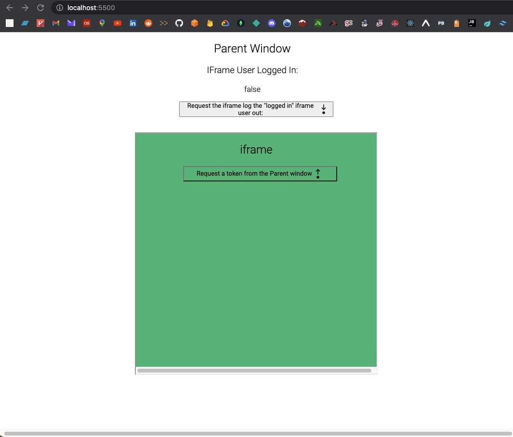

### _Liaison_ Parent App Example
This is a simple web page that demonstrates how to use the `Parent` model exported from [liaison-core](https://www.npmjs.com/package/liaison-core) to:
> Define an API of side effects that can be run within the iframe, when requested by the enclosing window.

Futher explanations of the API created by this library are explained on:
- [npm](https://www.npmjs.com/package/liaison-core)
- [github](https://github.com/Drew-Daniels/liaison-core#readme)

#### Why
This demo illustrates how we can use `liaison-core` to enable a parent window or iframe to:
- **request** data from the other
- **notify** the other that some event has occurred on the other

#### Example Background
There is 1 hypothetical "user" using both the parent window and the iframe applications.
- The parent application and the iframe _share_ the authentication for that user.
- When the iframe _requests_ a token get sent from the parent, the parent responds by sending a token back to the iframe.
- At this point, the user is "authenticated" in the iframe when it saves this token to `localStorage`.
- When the parent application _requests_ that the iframe log the user out, the iframe removes this token from `localStorage` and _notifies_ the parent that it can resume its logout steps.

The point of this example is to illustrate how we can use `liaison-core` to enable easily configurable, bi-directional data flows between a parent window and an iframe embedded within that window.

This is an alternative to using [postMessage](https://developer.mozilla.org/en-US/docs/Web/API/Window/postMessage) directly, and having to define a data transferance API yourself.

#### To Run Locally:
- Clone this repo
```shell
git clone https://github.com/Drew-Daniels/liaison-parent-app.git
```
- Open VSCode
```shell
code liaison-parent-app
```
- Ensure you have the [Live Server](https://marketplace.visualstudio.com/items?itemName=ritwickdey.LiveServer) extension installed
- Start the server
- Follow the local setup steps in this repo: [liaison-iframe-app](https://github.com/Drew-Daniels/liaison-iframe-app#readme)
- One both servers are running, you should see something like this:

